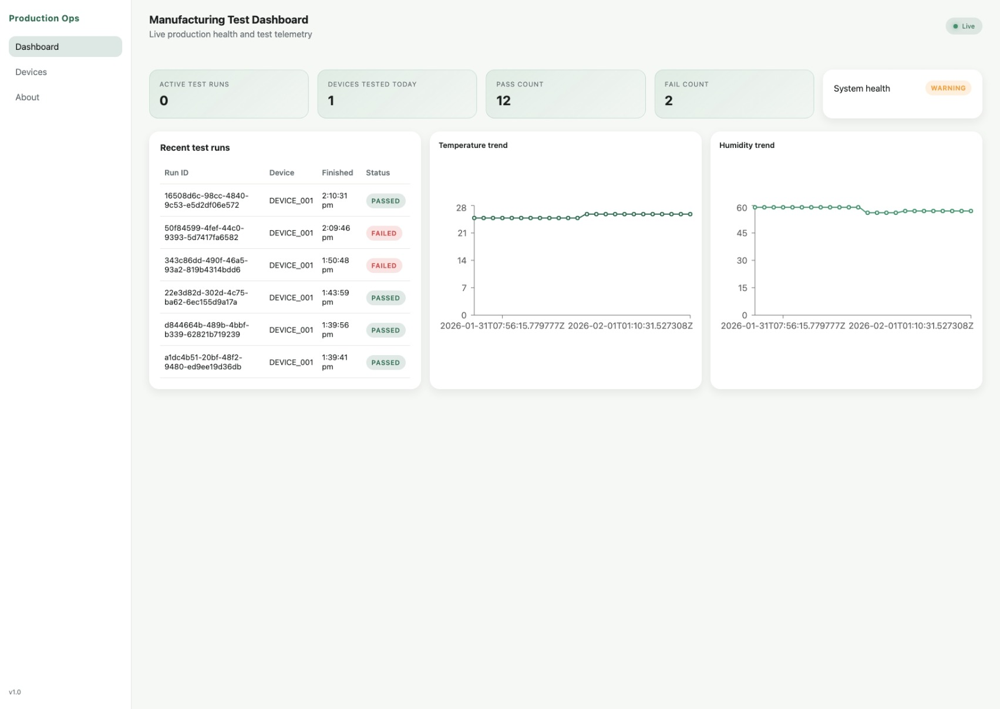
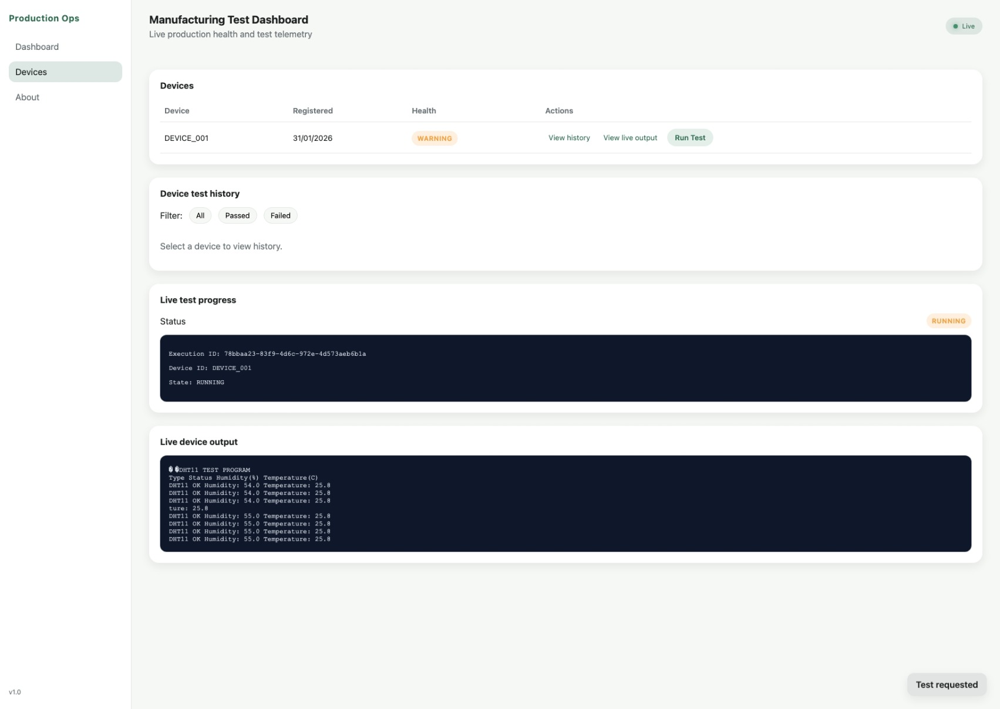
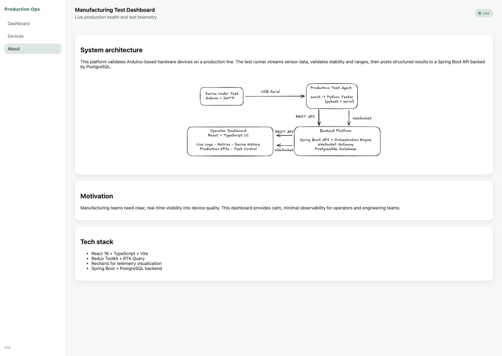
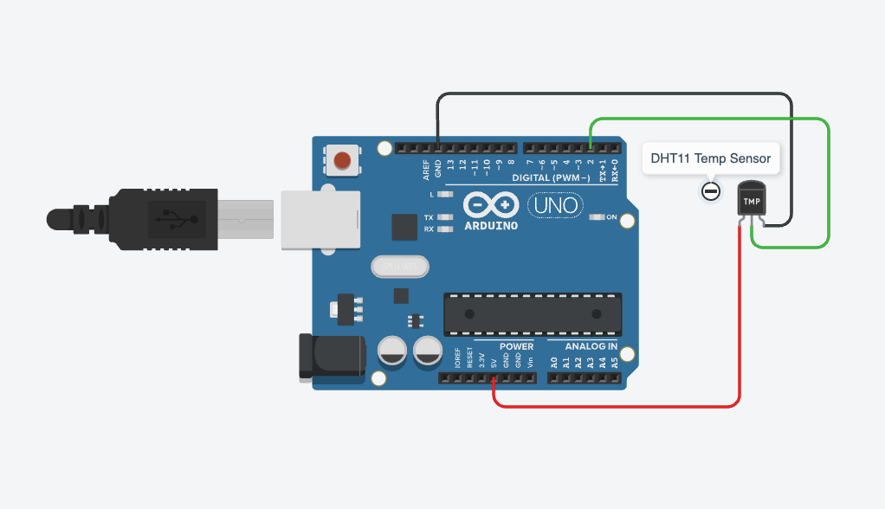

# ProductionSystemsDemo

Author: **Lachlan Pearce**

This project was built to support my job application for **Full Stack Software Engineer – Production Systems** at Halter:
https://jobs.lever.co/halter/8b8df411-3412-4a99-9b53-18914b1b7d0d

## Overview

This is a production-style hardware validation platform that:

- Uses an **Arduino Nano** with a **DHT temperature sensor** connected over **USB serial**.
- Runs a **containerized Python test runner** that reads sensor data and posts structured results.
- Exposes a **Spring Boot (Java) API** backed by **PostgreSQL** for devices, runs, and results.
- Provides a **React + TypeScript dashboard** with REST endpoints and **live device output streaming** via a macOS **socat** serial bridge.

## Architecture

### Hardware + Test Runner

- Arduino Nano + DHT sensor sends readings over USB serial.
- Python test runner (pytest) connects to the serial stream and records JSON-formatted results.
- The test runner runs inside Docker for consistent execution.

### Backend (Spring Boot + PostgreSQL)

- Spring Boot 3 (Java 17) REST API with JPA/Hibernate.
- PostgreSQL stores devices, test runs, test results, and sensor readings.
- Flyway migrations manage schema evolution.
- Endpoints provide device lists, run history, metrics, and execution control.

### Frontend (React)

- React 18 + Vite + TypeScript dashboard.
- RTK Query for data fetching, charts via Recharts.
- Device runs and metrics are pulled from REST endpoints.
- Live output uses SSE from the backend, which streams data from a **socat**-bridged serial TCP socket.

### Live test run trigger (UI → API → Python)

- The UI posts a **run-test** request to the backend REST API for a selected device.
- The backend records a pending test execution and exposes it to the Python test runner.
- The Python test runner (agent) polls the API, claims the next pending execution, runs the tests automatically, and posts results back to the API.

## Tests Executed

The Python test runner executes the following tests:

- **Connectivity**: validates that temperature and humidity readings are present.
- **Range validation**: checks readings fall within configured min/max bounds.
- **Stability**: samples multiple readings and verifies standard deviation is within thresholds.

## Screenshots

### Dashboard

### Devices

### About

## Hardware setup

I could not find a breadboard or a soldering iron at home, so the hardware setup is held together with bluetac.

### Arduino Nano wiring (pin-out)

### Physical setup photo

## How to Run

### Run everything (macOS + Docker)

The `make run-with-bridge` target:

1. Starts **socat** to bridge USB serial to TCP.
2. Builds and runs **backend**, **postgres**, **frontend**, and **python-tester-agent** containers.
3. Runs the **python-tester** container against the TCP bridge.

Command:

- `make run-with-bridge`

### Custom serial device and port

- `make run-with-bridge SERIAL_PORT=/dev/cu.usbserial-1230 SOCAT_PORT=4000`

The socat bridge uses a macOS-compatible command with `OPEN:` and `ispeed/ospeed`.

Logs are JSON-formatted to stdout. Results are written to `./python-tester/test-results`.